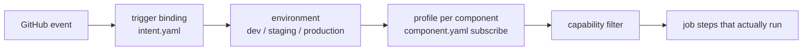

# stack-tectonic-flare

Reusable [Orun](https://github.com/sourceplane/orun) compositions for shipping a multi-tenant SaaS
on Cloudflare — Pages sites, Workers, Turborepo packages, and the Terraform that backs them.

This repository is both:

1. **A composition catalog.** Nine compositions under [`stacks/stack-tectonic-flare/`](stacks/stack-tectonic-flare)
   describe how a class of component is built, verified, and deployed.
2. **A stack that publishes itself.** Its own CI uses the `publish-stack` composition to package the
   catalog and push it to
   [`ghcr.io/sourceplane/saas-stack-tectonic-flare`](https://github.com/sourceplane/stack-tectonic-flare/pkgs/container/saas-stack-tectonic-flare),
   so consumer repos can pin a version instead of copying YAML.

## Repository layout

```
intent.yaml                      # environments, trigger bindings, composition sources
kiox.yaml / kiox.lock            # pinned orun provider for the kiox workspace
.github/workflows/verify.yml     # plan job -> matrix of orun jobs
stacks/stack-tectonic-flare/
  stack.yaml                     # package identity: name, version, OCI registry target
  component.yaml                 # the one component in this repo: publish this stack
  compositions/<name>/
    composition.yaml             # what the composition is: schema, jobs, profiles
    schema.yaml                  # JSON Schema for a component of this type
    jobs/*.yaml                  # JobTemplate: the full ordered step list
    profiles/*.yaml              # ExecutionProfile: which capabilities run in which lane
    README.md                    # generated-by-hand docs for consumers
```

## The catalog

| Composition | Use it for | Deploy mechanism | Docs |
|---|---|---|---|
| [`cloudflare-pages`](stacks/stack-tectonic-flare/compositions/cloudflare-pages) | A standalone static site in its own directory | Wrangler direct upload | [README](stacks/stack-tectonic-flare/compositions/cloudflare-pages/README.md) |
| [`cloudflare-pages-turbo`](stacks/stack-tectonic-flare/compositions/cloudflare-pages-turbo) | A Pages app inside a pnpm + Turborepo monorepo | Wrangler direct upload | [README](stacks/stack-tectonic-flare/compositions/cloudflare-pages-turbo/README.md) |
| [`cloudflare-pages-terraform`](stacks/stack-tectonic-flare/compositions/cloudflare-pages-terraform) | A standalone site whose Pages project is Git-connected | Terraform apply | [README](stacks/stack-tectonic-flare/compositions/cloudflare-pages-terraform/README.md) |
| [`cloudflare-pages-turbo-terraform`](stacks/stack-tectonic-flare/compositions/cloudflare-pages-turbo-terraform) | A monorepo Pages app whose project is Git-connected | Terraform apply | [README](stacks/stack-tectonic-flare/compositions/cloudflare-pages-turbo-terraform/README.md) |
| [`cloudflare-worker`](stacks/stack-tectonic-flare/compositions/cloudflare-worker) | A standalone Worker with its own install/build commands | `wrangler deploy` | [README](stacks/stack-tectonic-flare/compositions/cloudflare-worker/README.md) |
| [`cloudflare-worker-turbo`](stacks/stack-tectonic-flare/compositions/cloudflare-worker-turbo) | A Worker inside a pnpm + Turborepo monorepo | `wrangler deploy` | [README](stacks/stack-tectonic-flare/compositions/cloudflare-worker-turbo/README.md) |
| [`turbo-package`](stacks/stack-tectonic-flare/compositions/turbo-package) | A shared library package — verification only | none | [README](stacks/stack-tectonic-flare/compositions/turbo-package/README.md) |
| [`terraform`](stacks/stack-tectonic-flare/compositions/terraform) | Standalone infrastructure — fmt, init, validate, plan | none | [README](stacks/stack-tectonic-flare/compositions/terraform/README.md) |
| [`publish-stack`](stacks/stack-tectonic-flare/compositions/publish-stack) | Publishing an Orun stack to an OCI registry | `orun publish` | [README](stacks/stack-tectonic-flare/compositions/publish-stack/README.md) |

Picking between the variants:

- **`-turbo` or not?** Use a `-turbo` variant when the component lives in a pnpm workspace and is built
  through `turbo run`. Those compositions run `pnpm install` at the repo root and target the component
  with a Turbo filter. The plain variants take explicit `installCommand` / `buildCommand` strings and
  run them inside `siteDir`.
- **`-terraform` or not?** Use a `-terraform` variant when the Cloudflare Pages project is **Git-connected**
  (Cloudflare builds on push, and Terraform owns the project resource). Use the plain variant when CI
  builds the assets and **direct-uploads** them with Wrangler.

Full stack-level conventions — the capability model, the shared profile lanes, and how the pieces
resolve — are in [`stacks/stack-tectonic-flare/README.md`](stacks/stack-tectonic-flare/README.md).

## How a run is produced



1. **Trigger binding** — `intent.yaml` maps a GitHub event to a planning scope. A pull request plans only
   changed components (`base..head`); a `v*` tag plans everything.
2. **Environment** — each binding activates one environment, which carries a default lane, a namespace
   prefix, and approval policy.
3. **Profile** — a component's `subscribe.environments[].profile` picks the execution profile for that
   environment; the environment's `defaults.lane` is the fallback for components that don't pin one.
4. **Capabilities** — the profile lists `includeCapabilities`. Steps in the job template whose
   `capability` is not in that list are dropped from the plan. One job template therefore serves the
   PR lane, the verify lane, and the deploy lane without branching inside the steps.

| Trigger | Event | Environment | Plan scope | Approval |
|---|---|---|---|---|
| `github-pull-request` | PR opened / synchronize / reopened / ready_for_review against `main` | `dev` (`dev-`) | changed only | no |
| `github-push-main` | push to `main` | `staging` (`stg-`) | changed only | yes |
| `github-tag-release` | push tag `v*` | `production` (`prod-`) | full | yes |

## CI

[`.github/workflows/verify.yml`](.github/workflows/verify.yml) has two jobs:

- **`plan`** runs `orun plan --changed --from-ci github --event-file "$GITHUB_EVENT_PATH"` and uploads
  `plan.json`, exposing the planned jobs as a matrix.
- **`run`** fans out over that matrix, one runner per planned job, and executes
  `orun run --plan plan.json --job <id> --remote-state`. Check names look like
  `stack-tectonic · staging · Publish`.

If a change touches no component, the matrix is empty and the `run` job is skipped — that is a pass,
not a failure.

The workflow listens on `push: branches: [main]` and `pull_request` only, so the `github-pull-request`
and `github-push-main` bindings are the two that fire in this repo today. `github-tag-release` is
declared for consumers (and for a future tag-triggered workflow); pushing a `v*` tag here does not
start a run on its own.

Secrets consumed by the `run` job: `ORUN_BACKEND_URL`, `CLOUDFLARE_ACCOUNT_ID`, `CLOUDFLARE_API_TOKEN`,
`SUPABASE_API_KEY`, plus the workflow's `GITHUB_TOKEN` for GHCR login.

## Consuming the catalog

Point a consumer repo's `intent.yaml` at the published package instead of a local directory:

```yaml
compositions:
  sources:
    - name: stack-tectonic-flare
      kind: oci
      ref: ghcr.io/sourceplane/saas-stack-tectonic-flare:2.1.0
```

Then declare components against the composition types:

```yaml
# apps/docs/component.yaml
apiVersion: sourceplane.io/v1
kind: Component
metadata:
  name: docs-site
spec:
  type: cloudflare-pages
  subscribe:
    environments:
      - name: dev
        profile: pull-request
      - name: production
        profile: deploy
  inputs:
    siteDir: apps/docs
    installCommand: npm ci
    buildCommand: npm run build
    outputDir: dist
    projectName: tectonic-docs
    nodeVersion: "20"
    productionBranch: main
```

To read a published package without wiring an intent, download it:

```bash
orun fetch ghcr.io/sourceplane/saas-stack-tectonic-flare:2.1.0 --output ./tectonic-flare
```

## Local development

```bash
orun compositions list                    # what this catalog exports
orun composition cloudflare-worker -e     # one composition, with every step expanded
orun plan --intent intent.yaml            # what would run right now
cd stacks/stack-tectonic-flare && orun publish --dry-run
```

`orun publish` resolves the package name, version, and registry from
[`stacks/stack-tectonic-flare/stack.yaml`](stacks/stack-tectonic-flare/stack.yaml), so it must be run
from that directory (or with `--root` pointed at it).

## Releasing

The version lives in `stacks/stack-tectonic-flare/stack.yaml`. Publishing happens from CI when a change
to the stack lands on `main`: the `stack-tectonic` component subscribes to `staging` with the `release`
profile, which runs `orun publish --dry-run` and then the real `orun publish`.

1. Bump `metadata.version` in `stacks/stack-tectonic-flare/stack.yaml`.
2. Merge to `main`. The `stack-tectonic · staging · Publish` check performs the upload.
3. Verify the tag exists in the registry:

   ```bash
   TOKEN=$(curl -s "https://ghcr.io/token?scope=repository:sourceplane/saas-stack-tectonic-flare:pull&service=ghcr.io" | jq -r .token)
   curl -s -H "Authorization: Bearer $TOKEN" \
     https://ghcr.io/v2/sourceplane/saas-stack-tectonic-flare/tags/list | jq
   ```

4. Tag the commit `vX.Y.Z` to keep the git history aligned with the published versions.

Re-publishing an existing version is not meaningful — bump the version in the same PR that changes the
catalog, so every merge to `main` either publishes something new or publishes nothing.
